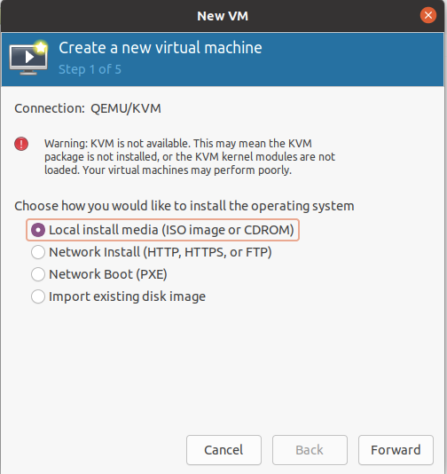
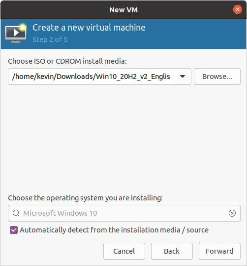
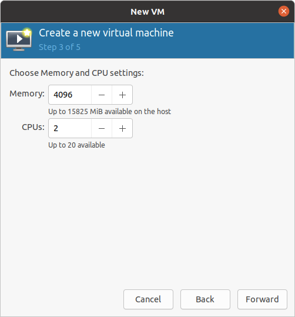
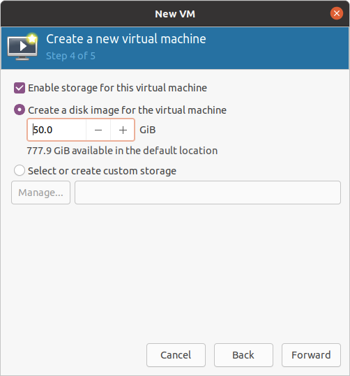
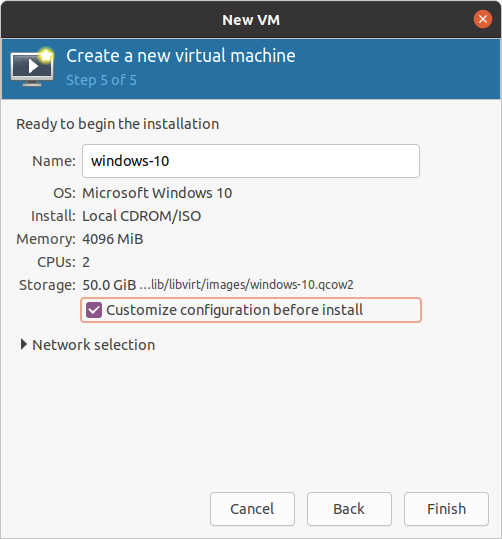
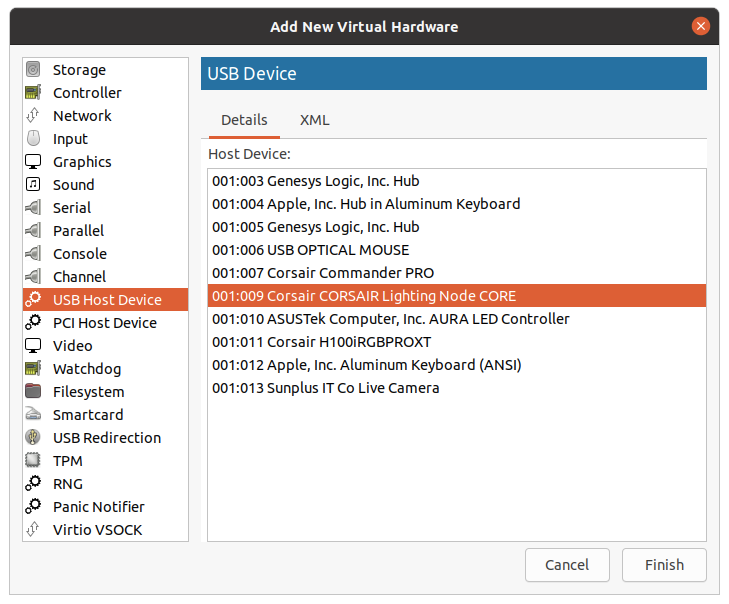
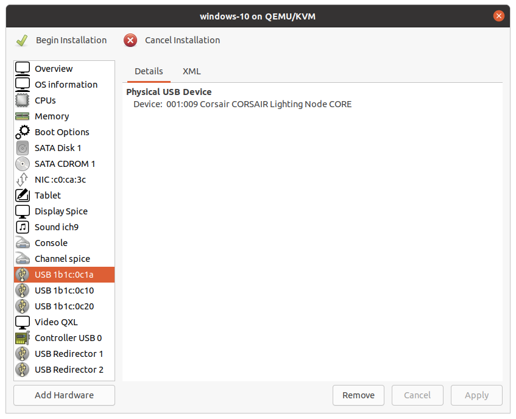
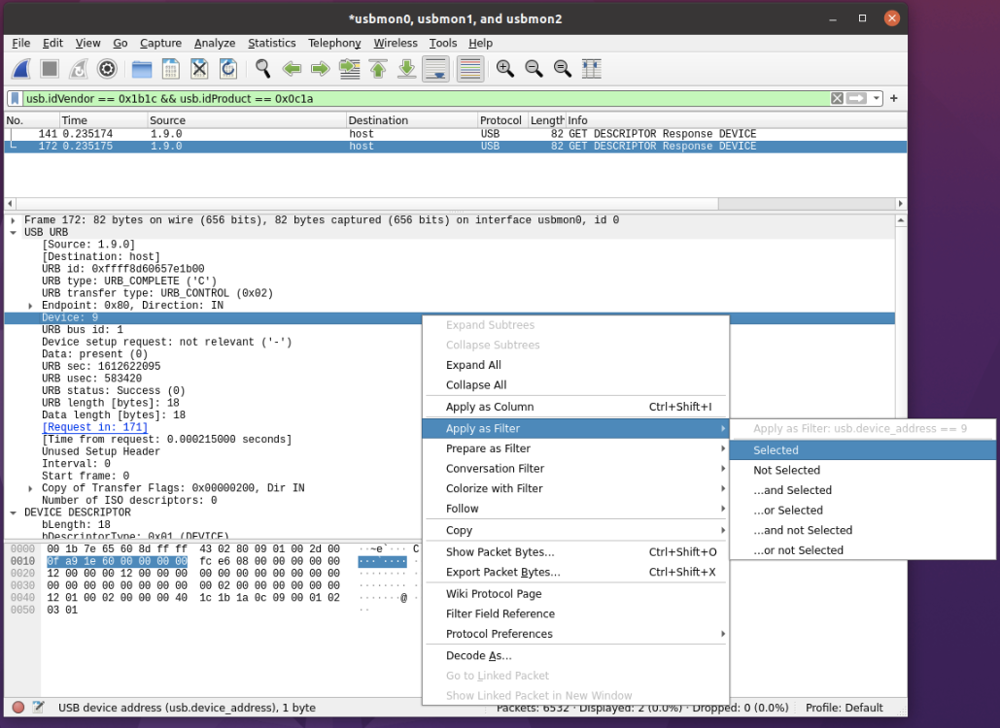
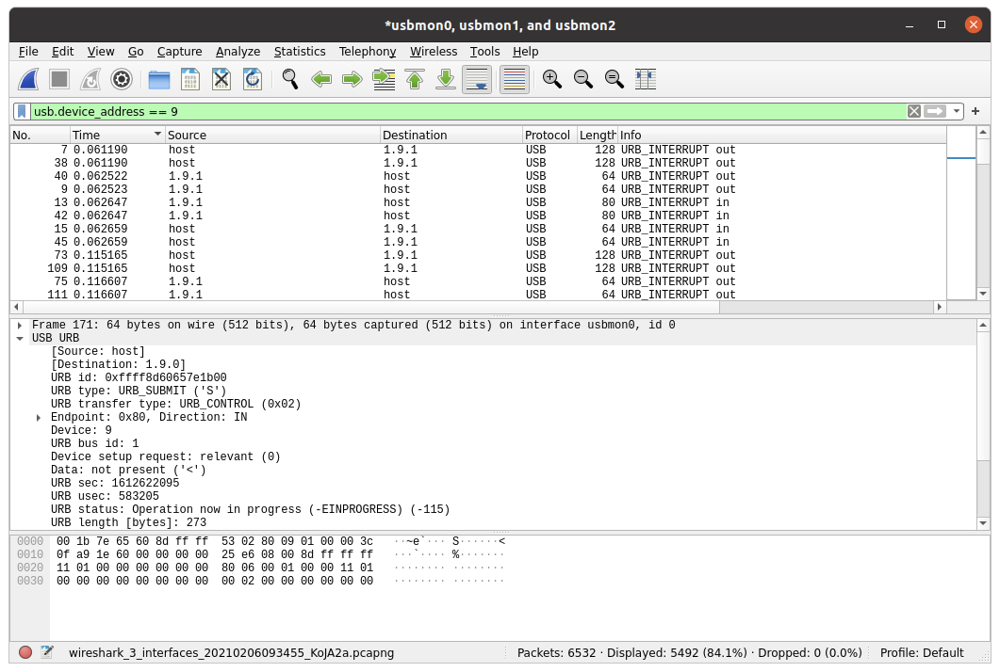

# Capturing USB traffic

## Preface

A fundamental aspect of developing drivers for USB devices is inspecting the
traffic between applications and the device.

This is useful for debugging your own drivers and applications, as well as to
understand undocumented protocols.

In the latter case, a possibly opaque and closed source application is allowed
to communicate with the device, and the captured traffic is analyzed to
understand what the device is capable of and what it expects from the host
application.


## Capturing USB traffic on a native Windows host

Capturing traffic between the source application and your device requires a little setup, but once in place gives you a powerful tool to decipher the protocol.  For Corsair devices, for example, the application that controls your device and issues the device-specific commands is the Corsair iCue software which runs on Windows.  This guide will take you through the steps to set up the network traffic listener specifically for Corsair, but these instructions will be applicable for any other devices that are controlled from Windows software.  I chose Corsair for this because that's the only device I have at my disposal 🙂

Basic Steps:
1. Enable Virtualization in your BIOS
2. Install a Virtual Machine manager.
3. Create a  Windows VM
4. Install and run your device controlling software in the Windows VM (Corsair iCue in this example).
5. Install wireshark on your Linux box.
6. Set up a filter so that ONLY the traffic between your Windows VM and Device are captured.
7. Capture the traffic!


### Step 1. Enable Virtualization in your BIOS

The first step to getting your windows 10 64-bit VM up and running is to ensure your motherboard enables hardware support for Intel VT-x or AMD-v.  These features  are required in order to run a 64-bit VM, or have a VM that supports more than 1 CPU core.   In most modern motherboards these features are disabled by default, so you may need to enable them in your BIOS.  The exact setting to check is motherboard dependent, but should be something in the "virtualization" universe.  This post lists a few of the common settings, but to save you a click, you can look for the following:
- "Enable Virtualization Technology", 
- "Enable SVM Mode" (AMD CPUs), 
- "Enable Vanderpool Technology" (Intel)
- "Secure Virtual Mode"
- "Intel (VMX) Virtualization Technology"

On my z490-f motherboard, the last setting was the correct one.  If you poked around and can't find a setting that seems right, and your motherboard is somewhat recent (last 5 years), then it might be enabled by default and you can just move on the next step.  You will know for sure whether it is enabled if you are unable to create a 64 bit windows 10 VM in step 3.  If that's the case, then you'll need to look harder for the setting in your BIOS, or get your Google on.

If you do make any changes in your BIOS then do a power cycle (turn the computer totally off, then on) to ensure the BIOS changes are enabled.  Sometimes a reboot doesn't do it, and the extra few seconds turning the computer all the way off is a good investment to eliminate variables.


### Step 2. Install a Virtual Machine manager

My Virtual Machine software of choice for Linus is virt-manager.  VirtualBox is also popular, but I have had mixed results with it so default to virt-manager which can be installed via your favorite package manager.
```
sudo apt-get install virt-manager
```
Start it up. 
```
virt-manager
```
You might get a warning about a missing daemon running.  If so, enable the daemon.
Reboot. 


### Step 3. Create a Windows VM

With the hardware all set to go and virt-manager installed, its time to create the guest VM running Windows 10.  
First, download the Windows 10 ISO:  https://www.microsoft.com/en-in/software-download/windows10ISO
You will need a free Microsoft account to download the ISO, but you do not need a license (assuming you are just using the VM for testing).

Start virt-manager
```
virt-manager
```
After Virtual Machine Manager opens, create a new VM by selecting File -> "Create New Virtual Machine", or click this icon in the toolbar.  


If you see a warning message on that "Create a virtual machine" screen that KVM is not available, then this is a sign that virtualization is likely disabled in your bios.  Please see step 1.  
  

If you continue forward without resolving this, then you are likely to encounter this scary message at some point.
  

Assuming you are all set, then ensure the "Local install media option" is selected, then select "Forward".  
  

Choose the ISO you downloaded previously, and click Forward.  
  

Allocate sufficient CPU and memory (I chose 2 CPU and 4 GB of memory).  Click Forward.
  

Next choose as much disk space as you deem necessary (I chose 50GB).  Click Forward.
  

In the last screen, check "Customize configuration before install, and click Finish.
  

This will take you to this screen:
  

This is the screen that enables you to make your attached devices available to the guest VM.  In my case, I want to make my Corsair Lightning Node Core, Corsair Commander Pro, and Corsair H100i RGB Pro XT available to the guest VM so that I can control them in the guest VM via the Corsair iCue software.  
To make them available to the guest VM, click "Add Hardware", then select "USB Host Device".  The right side of the screen will list off the USB devices attached to your motherboard.  Select the device you would like to add and click Finish. 
  

Repeat this for each device you would like to add to your guest VM.  In my case, I selected the 3 Corsair devices.  Once added, they should show up in your VMs hardware list.  In the screenshot below, they are the 3 USB devices.
  

Then, click "Begin Installation" in the non-obvious upper left corner and follow the on-screen instructions to install Windows 10.


### Step 4. Install and run your device controlling software in the Windows VM 

Once Windows 10 is installed, install the software that will control your device.  In the case of a Corsair device, the software is Corsair iCue.  Download the latest version from Corsair's website and install it.  When you run it for the first time, it should auto-detect your devices, allowing you to control them as you see fit.  If you are controlling RGB lighting like I was, then go crazy experimenting with some of the neato effects. 
  

When you are done playing, it's time to start snooping on the network traffic that the software is using to control the device(s).


### Step 5. Install wireshark on your Linux box.

```
sudo apt install wireshark
```

### Step 6. Set up a filter so that ONLY the traffic between your Windows VM and Device are captured.
Ensure your guest VM is running.
Be sure usbmon kernel module is loaded so you can capture USB traffic
```
cat /proc/modules | grep usbmon
```

if it isn't there, then load it.
```
sudo modprobe usbmon
```

Start Wireshark
```
sudo wireshark
```

Once open, select Capture -> Options in the top menu (or hit Ctrl-K).  
  

This window allows you to filter your traffic sniffing to only certain devices.  For our purposes, we only want to list to USB traffic since our devices are attached via USB to our motherboard.
Select all the "usbmon" devices that you see, then click Start.  If you do not see any usbmon devices, then you likely don't have the usbmon kernel module loaded.  Please see the instructions above.

After pressing Start, wireshark will start listening for traffic across all your USB devices.  You should see messages appearing in the main content windows of wireshark.
  

If you see messages. then that indicates that wireshark can successfully listen to all your USB traffic and we are nearly there.  Let it listen for a few seconds, then press the red square button in the top icon bar to stop listening for traffic.

Next step is to filter for only the messages we care about.  To do so, first find the vendorId, and the productId of your devices.  The easiest way to find them is in your VM configuration.  In your running guest VM, click the "Show Virtual Hardware Details" button.  
  

In the virtual hardware window, select the USB device on the left-hand side of the window that corresponds to the device you would like to monitor.  In my case, it is the Corsair Lightning Node Core device.  On the left hand side, you can see the "USB 1b1c:0c1a".  The first number "1b1c" is the vendorId, and the second number "0c1a" is the productId.  You'll need these for filtering.
  

Return back to Wireshark and in the top filter bar, enter the following, replacing the values with your vendor and product ids.  Press enter to activate the filter.
```
usb.idVendor == 0x1b1c && usb.idProduct == 0x0c1a
```

If you have entered the values correctly (note the "0x" prepended to the values), you should have filtered the captured traffic to only be the GET DESCRIPTOR responses.
  

Next step is to get the device address so that we can tell wireshark to only capture traffic to our desired device.
Highlight one of the GET DESCRIPTOR response packets, expand the USB URB section in the packet details, and find the "Device: #" line. This is the device address.   Right click the "Device: #" entry, choose "Apply As Filter", then "Selected".  In my screenshot below, the device number was 9.
  

This will change your packet filter to something like "usb.device_address == 9", which is exactly what we want.  Now only traffic sent to that specific device will be captured.
  

Success!  You can now modify settings for your device in the the guest VM, and capture the traffic in wireshark.  For convenience, you may want to save your filter for future captures.  Click on the bookmark icon immediately next to the filter to save it.

### Step 7. Capture the traffic!
With everything now in place you are all set to capture traffic.  Click the shark fin button in the menu bar to start a fresh capture, then make your device changes in the guest VM to generate your desired traffic. When you are happy with the results, stop the capture and export your traffic File -> Export Specified packets.


## Next steps

Once you have your usb capture (probably in a `pcapng` format). You may find it easer to look at the data outside
of Wireshark since Wireshark sometimes limits the number of bytes shown to fewer then the amount you want to look at.

I generally like to use `tshark`, one of the cli tools that comes with Wireshark to extract the only the fields I care about
so that I can easily only show the fields I can about and can use other bash commands to separate the fields and remove
some of the extraneous messages (for example Corsair iCue sends a get status message every second which I am generally not
interested in).

Next steps would be to take a look at (analyzing USB protocols)[techniques-for-analyzing-usb-protocols.md]

[Wireshark]: https://www.wireshark.org
[USBPcap]: https://desowin.org/usbpcap/
